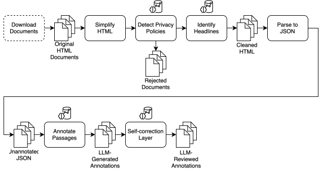

# Privacy Policy Annotator

## Project Overview

This Python project comprises a customizable data processing pipeline for the LLM-powered annotation of GDPR-mandated transparency requirements in privacy policies of Android applications.

The following GDPR transparency requirements are considered for annotation:

| Label                               | Article                         | Description                                                                                                                                                                                                                                                                                                                                                                                                                                                     | Examples                                                                                                                                        |
|-------------------------------------|---------------------------------|-----------------------------------------------------------------------------------------------------------------------------------------------------------------------------------------------------------------------------------------------------------------------------------------------------------------------------------------------------------------------------------------------------------------------------------------------------------------|-------------------------------------------------------------------------------------------------------------------------------------------------|
| Controller Name                     | Art. 13(1)(a) and Art. 14(1)(a) | the identity [...] of the controller and, where applicable, of the controller's representative                                                                                                                                                                                                                                                                                                                                                                  | "ThisSpecialApp", "AppDeveloper GmbH"                                                                                                           |
| Controller Contact                  | Art. 13(1)(a) and Art. 14(1)(a) | the [...] contact details of the controller and, where applicable, of the controller's representative                                                                                                                                                                                                                                                                                                                                                           | "email@appdeveloper.com", "Ernst-Reuter-Platz 1, 10587 Berlin"                                                                                  |
| DPO Contact                         | Art. 13(1)(b) and Art. 14(1)(b) | the contact details of the data protection officer, where applicable;                                                                                                                                                                                                                                                                                                                                                                                           | "dpo@bigdeveloper.com", "Ernst-Reuter-Platz 1, 10587 Berlin "                                                                                   |
| Data Categories                     | Art Art. 14(1)(d)               | the categories of personal data concerned;                                                                                                                                                                                                                                                                                                                                                                                                                      | "Name", "Email Address", "Payment Information"                                                                                                  |
| Processing Purpose                  | Art. 13(1)(c) and Art. 14(1)(c) | the purposes of the processing for which the personal data are intended as well as the legal basis for the processing; [...] whether the provision of personal data is a statutory or contractual requirement, or a requirement necessary to enter into a contract, as well as whether the data subject is obliged to provide the personal data and of the possible consequences of failure to provide such data;                                               | "Provide a service", "Send marketing emails"                                                                                                    |
| Legal Basis for Processing          | Art. 13(1)(c) and Art. 14(1)(c) | the purposes of the processing for which the personal data are intended as well as the legal basis for the processing;                                                                                                                                                                                                                                                                                                                                          | "Your consent", "Our legitimate interests"                                                                                                      |
| Legitimate Interests for Processing | Art. 13(1)(d)                   | where the processing is based on point (f) of Article 6(1), the legitimate interests pursued by the controller or by a third party;                                                                                                                                                                                                                                                                                                                             | "Provide a service", "Improve the service"                                                                                                      |
| Source of Data                      | Art. 14(2)(f)                   | from which source the personal data originate, and if applicable, whether it came from publicly accessible sources;                                                                                                                                                                                                                                                                                                                                             | "Directly from the user", "From a third party"                                                                                                  |
| Data Storage Period                 | Art. 13(2)(a) and Art. 14(2)(a) | the period for which the personal data will be stored, or if that is not possible, the criteria used to determine that period;                                                                                                                                                                                                                                                                                                                                  | "Until the user deletes their account", "For 3 years"                                                                                           |
| Data Recipients                     | Art 13 1(e) and Art. 14(1)(e)   | the [third-party] recipients or categories of [third-party] recipients of the personal data, if any;                                                                                                                                                                                                                                                                                                                                                            | "Google Analytics", "Google Firebase"                                                                                                           |
| Third-country Transfers             | Art. 13(1)(f) and Art. 14(1)(f) | where applicable, the fact that the controller intends to transfer personal data to a third country or international organisation and the existence or absence of an adequacy decision by the Commission, or in the case of transfers referred to in Article 46 or 47, or the second subparagraph of Article 49(1), reference to the appropriate or suitable safeguards and the means by which to obtain a copy of them or where they have been made available. | "United States", "Jurisdictions across the globe"                                                                                               |
| Mandatory Data Disclosure           | Art. 13(2)(e)                   | whether the provision of personal data is a statutory or contractual requirement, or a requirement necessary to enter into a contract, as well as whether the data subject is obliged to provide the personal data and of the possible consequences of failure to provide such data;                                                                                                                                                                            | "Required by law to provide tax information", "Necessary to provide payment details for a subscription"                                         |
| Automated Decision Making           | Art. 13(2)(f) and Art. 14(2)(f) | the existence of automated decision-making, including profiling, referred to in Article 22(1) and (4) and, at least in those cases, meaningful information about the logic involved, as well as the significance and the envisaged consequences of such processing for the data subject.                                                                                                                                                                        | "Profiling", "Automated decision making"                                                                                                        |
| Right to Access                     | Art. 13(2)(b) and Art. 14(2)(c) | the existence of the right to request from the controller access to [...] personal data [...];                                                                                                                                                                                                                                                                                                                                                                  | "You may request a copy of your data", "We will provide you with a copy of your data"                                                           |
| Right to Rectification              | Art. 13(2)(b) and Art. 14(2)(c) | the existence of the right to request from the controller [...] rectification [...] of personal data [...];                                                                                                                                                                                                                                                                                                                                                     | "If your data is incorrect, you may request that we correct it", "We will correct your data upon request"                                       |
| Right to Erasure                    | Art. 13(2)(b) and Art. 14(2)(c) | the existence of the right to request from the controller [...] erasure of personal data [...];                                                                                                                                                                                                                                                                                                                                                                 | "You may request that we erase your data", "We will erase your data upon request"                                                               |
| Right to Restrict                   | Art. 13(2)(b) and Art. 14(2)(c) | the existence of the right to request from the controller [...] restriction of processing concerning the data subject [...];                                                                                                                                                                                                                                                                                                                                    | "You may request that we restrict the processing of your data", "We will restrict the processing of your data upon request"                     |
| Right to Object                     | Art. 13(2)(b) and Art. 14(2)(c) | the existence of the right [...] to object to processing [...];                                                                                                                                                                                                                                                                                                                                                                                                 | "You may object to the processing of your data", "You may object to the processing of your data by contacting us"                               |
| Right to Portability                | Art. 13(2)(b) and Art. 14(2)(c) | the existence of [...] the right to data portability;                                                                                                                                                                                                                                                                                                                                                                                                           | "You may request a copy of your data in a machine-readable format", "We will provide you with a copy of your data in a machine-readable format" |
| Right to Withdraw Consent           | Art. 13(2)(c) and Art. 14(2)(d) | where the processing is based on point (a) of Article 6(1) or point (a) of Article 9(2), the existence of the right to withdraw consent at any time, without affecting the lawfulness of processing based on consent before its withdrawal;                                                                                                                                                                                                                     | "You may withdraw your consent at any time", "You may withdraw your consent by contacting us"                                                   |
| Right to Lodge Complaint            | Art. 13(2)(d) and Art. 14(2)(e) | the right to lodge a complaint with a supervisory authority;                                                                                                                                                                                                                                                                                                                                                                                                    | "You may lodge a complaint with the data protection authority", "You may lodge a complaint by contacting us"                                    |


## Setup

### Prerequisites

Before running the project, ensure you have the following installed:

- Python 3.7 or higher
- Required Python packages listed in `requirements.txt` (if any)

You can install the necessary Python packages by running:

```bash
pip install -r requirements.txt
```

To set up a virtual environment, you can use `venv`:

```bash
python -m venv venv
source env/bin/activate
pip install -r requirements.txt
```   

### Directory Structure

Ensure that your project directory is structured as follows:

```
project/
│
├── main.py
├── requirements.txt
├── .env
├── src/
└── output/
```

- **`main.py`**: This is the main script containing the `main()` function.
- **`requirements.txt`**: A file listing the Python dependencies required for the project.
- **`.env`**: A file containing your OpenAI API key. This file should never be committed to version control!
- **`src/`**: The directory containing the source code for the project.
- **`output/`**: The directory where the output files will be saved (generated by the pipeline).

## Running the Project

To run the project, you will execute the `main.py` script from the command line. The script requires a run ID to be provided and supports multiple optional arguments to customize the execution.

### OpenAI API Key

Before running the project, you need to set up an OpenAI API key. Create a file named `.env` in the project directory and add your API key as follows:

```
OPENAI_API_KEY=your-api-key-here
```


### Basic Command

```bash
python main.py -run-id <RUN_ID>
```

Replace `<RUN_ID>` with your specific run ID.

### Optional Arguments

- **`-run-id <RUN_ID>`**: Required. The unique identifier for this run.
- **`-model <MODEL_NAME>`**: Specify the default model to use for all steps.
- **`-model-detect <MODEL_NAME>`**: Specify the model to use for the detection step.
- **`-model-annotate <MODEL_NAME>`**: Specify the model to use for the annotation step.
- **`-model-review <MODEL_NAME>`**: Specify the model to use for the review step.
- **`-no-clean`**: Skip the cleaning step.
- **`-no-detect`**: Skip the detection step.
- **`-no-parse`**: Skip the parsing step.
- **`-no-annotate`**: Skip the annotation step.
- **`-no-review`**: Skip the review step.
- **`-batch-detect`**: Run the detection step in batch mode.
- **`-batch-annotate`**: Run the annotation step in batch mode.
- **`-batch-review`**: Run the review step in batch mode.
- **`-parallel-prompt`**: Use parallel prompting for processing.
- **`-custom-model`**: Use custom models for processing.
- **`-hostname <HOSTNAME>`**: Specify the hostname for the API client.
- **`-c <CONFIG_FILE>`**: Path to a JSON configuration file containing the above arguments.

### Example Commands

1. **Basic run with a run ID:**

   ```bash
   python main.py -run-id 12345
   ```

2. **Run with a specific package and model:**

   ```bash
   python main.py -run-id 12345 -pkg com.example.app -model gpt-4
   ```

3. **Run with step-specific models and batch processing:**

   ```bash
   python main.py -run-id 12345 -model-detect gpt-3.5-turbo -model-annotate gpt-4 -batch-detect -batch-annotate
   ```

4. **Run with a configuration file:**

   ```bash
   python main.py -c config.json
   ```

### Configuration File Format

The configuration file should be a JSON file with the following structure:

```json
{
    "run_id": "12345",
    "id_file": "path/to/id_file.txt",
    "pkg": "com.example.app",
    "default_model": "gpt-4",
    "models": {
        "detect": "gpt-3.5-turbo",
        "annotate": "gpt-4",
        "review": "gpt-4"
    },
    "skip_clean": false,
    "skip_detect": false,
    "skip_parse": false,
    "skip_annotate": false,
    "skip_review": false,
    "batch_detect": true,
    "batch_annotate": true,
    "batch_review": false,
    "parallel_prompt": true,
    "use_custom_model": false,
    "hostname": "api.example.com"
}
```

## Execution Flow

The annotation pipeline comprises the following steps:



The `main()` function processes the command-line arguments to determine which steps to execute or skip. Depending on the provided arguments, the pipeline is run with the specified configurations. If no optional arguments are provided, the pipeline runs with default settings.

### Handling Errors

- If no run ID is provided, the script will print an error message and exit.
- If invalid or incomplete arguments are provided, the script will also print an error message and exit.

## Customization

You can customize the pipeline further by modifying the `run_pipeline()` function. The arguments passed to `run_pipeline()` will dictate which steps of the pipeline are executed, skipped, or run in batch mode.

## Troubleshooting

If you encounter issues:

1. Ensure all required arguments are provided.
2. Check that the `requirements.txt` dependencies are installed.
3. Verify the paths to files and directories passed as arguments.

## Contributing

Feel free to open a new [issue](https://github.com/tomcory/policy-analysis/issues) for bug reports or feature requests. Pull requests for contributions are always welcome!

## License

This project is licensed under [GPLv3](https://www.gnu.org/licenses/gpl-3.0.html).

## Acknowledgments

This project is being developed by a team of researchers and students lead by Thomas Cory at the [Service-centric Networking](https://www.tu.berlin/snet) chair at Technische Universität Berlin.

### WebSocket Server

The application can also be run as a WebSocket server to support web-based frontends. To start the WebSocket server:

```bash
python main.py --websocket
```

The server will start on `ws://localhost:8765` by default.

#### WebSocket Protocol

The WebSocket server implements the following message protocol:

1. **State Updates** (Server → Client):
   ```json
   {
     "type": "state_update",
     "state": {
       "status": "idle|running|completed|error",
       "current_step": "string",
       "progress": 0.0-1.0,
       "message": "string",
       "error": "string|null"
     }
   }
   ```

2. **Start Pipeline** (Client → Server):
   ```json
   {
     "type": "start_pipeline",
     "config": {
       "run_id": "string",
       "id_file": "string|null",
       "pkg": "string|null",
       "default_model": "string|null",
       "models": {
         "detect": "string|null",
         "annotate": "string|null",
         "review": "string|null"
       },
       "skip_clean": boolean,
       "skip_detect": boolean,
       "skip_parse": boolean,
       "skip_annotate": boolean,
       "skip_review": boolean,
       "batch_detect": boolean,
       "batch_annotate": boolean,
       "batch_review": boolean,
       "parallel_prompt": boolean,
       "use_custom_model": boolean,
       "hostname": "string|null"
     }
   }
   ```

3. **Stop Pipeline** (Client → Server):
   ```json
   {
     "type": "stop_pipeline"
   }
   ```

#### Example WebSocket Client

Here's a simple example of how to connect to the WebSocket server using JavaScript:

```javascript
const ws = new WebSocket('ws://localhost:8765');

ws.onmessage = (event) => {
    const data = JSON.parse(event.data);
    if (data.type === 'state_update') {
        console.log('Pipeline status:', data.state.status);
        console.log('Current step:', data.state.current_step);
        console.log('Progress:', data.state.progress);
        console.log('Message:', data.state.message);
        if (data.state.error) {
            console.error('Error:', data.state.error);
        }
    }
};

// Start the pipeline
ws.onopen = () => {
    ws.send(JSON.stringify({
        type: 'start_pipeline',
        config: {
            run_id: '12345',
            pkg: 'com.example.app',
            default_model: 'gpt-4'
        }
    }));
};

// Stop the pipeline
function stopPipeline() {
    ws.send(JSON.stringify({
        type: 'stop_pipeline'
    }));
}
```