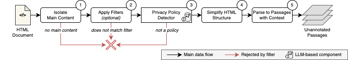
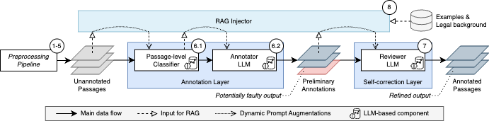

# Privacy Policy Annotator

This Python project comprises a customizable data processing pipeline for the LLM-powered annotation of GDPR-mandated transparency requirements in privacy policies of Android applications.

## Pipeline Architecture

The privacy policy annotation pipeline consists of two main stages: **Data Preprocessing** and **Annotation**. The former ingests raw HTML files containing privacy policies and prepares them for annotation, while the latter generates word-level annotations of disclosures relevant to GDPR Articles 13 and 14.

### Stage 1: Data Preprocessing Pipeline

The preprocessing pipeline transforms raw HTML documents into structured, annotation-ready passages while preserving essential context. This stage addresses the challenges of processing noisy HTML documents with extraneous elements like navigation menus, footers, and advertisements.



The preprocessing pipeline consists of five key steps:

1. **Isolate Main Content**: Rule-based filtering removes extraneous elements (nav, footer, script tags) and identifies the primary content container most likely to contain the privacy policy.

2. **Apply Filters**: Customizable filters improve efficiency by reducing irrelevant or low-quality documents:
   - Language filters for specific language requirements
   - Length-based filters to exclude suspiciously short or excessively long documents
   - Deduplication filters to prevent redundancy
   - Domain-specific filters for additional constraints

3. **Privacy Policy Detector**: LLM-based classifier analyzes document excerpts (~200 words) to determine if they contain actual privacy policies, achieving 99.7% accuracy on evaluation data.

4. **Simplify HTML Structure**: Converts HTML to pseudo-HTML by removing superfluous elements and attributes while preserving meaningful hierarchical cues and flattening redundant nesting.

5. **Parse Passages**: Transforms simplified HTML into structured passages with:
   - Textual content (v_p)
   - Contextual elements (C_p) including section headings and table headers
   - Element type (e_p): headlines, basic text, list elements, or table cells

### Stage 2: Annotation Pipeline

The annotation pipeline transforms structured passages into GDPR-aligned, fine-grained annotations through a two-layer approach: annotation generation and self-correction.



#### Annotation Layer

The annotation layer processes each passage individually to generate initial span-level annotations:

1. **Passage-Level Classifier**: LLM-based classifier predicts which GDPR transparency requirements are addressed in each passage, reducing the complexity of the annotation task.

2. **Word-Level Annotator**: Focuses on identifying exact text spans for each predicted label, creating annotations as 3-tuples: `a_t = (t, l, b)` where:
   - `t` = text span (e.g., "your email address")
   - `l` = label (e.g., "Data Categories")
   - `b` = boolean indicating affirmation (1) or denial (0)

#### Self-Correction Layer

The self-correction layer refines preliminary annotations through systematic review:

- **Modify** existing annotations with incorrect labels or boolean values
- **Remove** incorrect or irrelevant annotations
- **Add** new annotations for missed text spans
- **Correct** inaccurately identified spans

#### RAG (Retrieval-Augmented Generation) Injector

The RAG injector enhances LLM performance by dynamically augmenting prompts with relevant external information:

- **Legal Background**: GDPR excerpts, recitals, and commentary for each transparency requirement
- **Illustrative Examples**: Manually annotated policy passages demonstrating proper phrasing and label assignment
- **Two Retrieval Strategies**:
  - Similarity-based RAG: Retrieves examples based on semantic similarity
  - Label-aware RAG: Fetches examples and legal background specific to predicted labels

### GDPR Transparency Requirements

The following GDPR transparency requirements are considered for annotation:

| Label                               | Article                         | Description                                                                                                                                                                                                                                                                                                                                                                                                                                                     | Examples                                                                                                                                        |
|-------------------------------------|---------------------------------|-----------------------------------------------------------------------------------------------------------------------------------------------------------------------------------------------------------------------------------------------------------------------------------------------------------------------------------------------------------------------------------------------------------------------------------------------------------------|-------------------------------------------------------------------------------------------------------------------------------------------------|
| Controller Name                     | Art. 13(1)(a) and Art. 14(1)(a) | the identity [...] of the controller and, where applicable, of the controller's representative                                                                                                                                                                                                                                                                                                                                                                  | "ThisSpecialApp", "AppDeveloper GmbH"                                                                                                           |
| Controller Contact                  | Art. 13(1)(a) and Art. 14(1)(a) | the [...] contact details of the controller and, where applicable, of the controller's representative                                                                                                                                                                                                                                                                                                                                                           | "email@appdeveloper.com", "Ernst-Reuter-Platz 1, 10587 Berlin"                                                                                  |
| DPO Contact                         | Art. 13(1)(b) and Art. 14(1)(b) | the contact details of the data protection officer, where applicable;                                                                                                                                                                                                                                                                                                                                                                                           | "dpo@bigdeveloper.com", "Ernst-Reuter-Platz 1, 10587 Berlin "                                                                                   |
| Data Categories                     | Art Art. 14(1)(d)               | the categories of personal data concerned;                                                                                                                                                                                                                                                                                                                                                                                                                      | "Name", "Email Address", "Payment Information"                                                                                                  |
| Processing Purpose                  | Art. 13(1)(c) and Art. 14(1)(c) | the purposes of the processing for which the personal data are intended as well as the legal basis for the processing; [...] whether the provision of personal data is a statutory or contractual requirement, or a requirement necessary to enter into a contract, as well as whether the data subject is obliged to provide the personal data and of the possible consequences of failure to provide such data;                                               | "Provide a service", "Send marketing emails"                                                                                                    |
| Legal Basis for Processing          | Art. 13(1)(c) and Art. 14(1)(c) | the purposes of the processing for which the personal data are intended as well as the legal basis for the processing;                                                                                                                                                                                                                                                                                                                                          | "Your consent", "Our legitimate interests"                                                                                                      |
| Legitimate Interests for Processing | Art. 13(1)(d)                   | where the processing is based on point (f) of Article 6(1), the legitimate interests pursued by the controller or by a third party;                                                                                                                                                                                                                                                                                                                             | "Provide a service", "Improve the service"                                                                                                      |
| Source of Data                      | Art. 14(2)(f)                   | from which source the personal data originate, and if applicable, whether it came from publicly accessible sources;                                                                                                                                                                                                                                                                                                                                             | "Directly from the user", "From a third party"                                                                                                  |
| Data Storage Period                 | Art. 13(2)(a) and Art. 14(2)(a) | the period for which the personal data will be stored, or if that is not possible, the criteria used to determine that period;                                                                                                                                                                                                                                                                                                                                  | "Until the user deletes their account", "For 3 years"                                                                                           |
| Data Recipients                     | Art 13 1(e) and Art. 14(1)(e)   | the [third-party] recipients or categories of [third-party] recipients of the personal data, if any;                                                                                                                                                                                                                                                                                                                                                            | "Google Analytics", "Google Firebase"                                                                                                           |
| Third-country Transfers             | Art. 13(1)(f) and Art. 14(1)(f) | where applicable, the fact that the controller intends to transfer personal data to a third country or international organisation and the existence or absence of an adequacy decision by the Commission, or in the case of transfers referred to in Article 46 or 47, or the second subparagraph of Article 49(1), reference to the appropriate or suitable safeguards and the means by which to obtain a copy of them or where they have been made available. | "United States", "Jurisdictions across the globe"                                                                                               |
| Mandatory Data Disclosure           | Art. 13(2)(e)                   | whether the provision of personal data is a statutory or contractual requirement, or a requirement necessary to enter into a contract, as well as whether the data subject is obliged to provide the personal data and of the possible consequences of failure to provide such data;                                                                                                                                                                            | "Required by law to provide tax information", "Necessary to provide payment details for a subscription"                                         |
| Automated Decision-Making           | Art. 13(2)(f) and Art. 14(2)(f) | the existence of automated decision-making, including profiling, referred to in Article 22(1) and (4) and, at least in those cases, meaningful information about the logic involved, as well as the significance and the envisaged consequences of such processing for the data subject.                                                                                                                                                                        | "Profiling", "Automated Decision-Making"                                                                                                        |
| Right to Access                     | Art. 13(2)(b) and Art. 14(2)(c) | the existence of the right to request from the controller access to [...] personal data [...];                                                                                                                                                                                                                                                                                                                                                                  | "You may request a copy of your data", "We will provide you with a copy of your data"                                                           |
| Right to Rectification              | Art. 13(2)(b) and Art. 14(2)(c) | the existence of the right to request from the controller [...] rectification [...] of personal data [...];                                                                                                                                                                                                                                                                                                                                                     | "If your data is incorrect, you may request that we correct it", "We will correct your data upon request"                                       |
| Right to Erasure                    | Art. 13(2)(b) and Art. 14(2)(c) | the existence of the right to request from the controller [...] erasure of personal data [...];                                                                                                                                                                                                                                                                                                                                                                 | "You may request that we erase your data", "We will erase your data upon request"                                                               |
| Right to Restrict                   | Art. 13(2)(b) and Art. 14(2)(c) | the existence of the right to request from the controller [...] restriction of processing concerning the data subject [...];                                                                                                                                                                                                                                                                                                                                    | "You may request that we restrict the processing of your data", "We will restrict the processing of your data upon request"                     |
| Right to Object                     | Art. 13(2)(b) and Art. 14(2)(c) | the existence of the right [...] to object to processing [...];                                                                                                                                                                                                                                                                                                                                                                                                 | "You may object to the processing of your data", "You may object to the processing of your data by contacting us"                               |
| Right to Portability                | Art. 13(2)(b) and Art. 14(2)(c) | the existence of [...] the right to data portability;                                                                                                                                                                                                                                                                                                                                                                                                           | "You may request a copy of your data in a machine-readable format", "We will provide you with a copy of your data in a machine-readable format" |
| Right to Withdraw Consent           | Art. 13(2)(c) and Art. 14(2)(d) | where the processing is based on point (a) of Article 6(1) or point (a) of Article 9(2), the existence of the right to withdraw consent at any time, without affecting the lawfulness of processing based on consent before its withdrawal;                                                                                                                                                                                                                     | "You may withdraw your consent at any time", "You may withdraw your consent by contacting us"                                                   |
| Right to Lodge Complaint            | Art. 13(2)(d) and Art. 14(2)(e) | the right to lodge a complaint with a supervisory authority;                                                                                                                                                                                                                                                                                                                                                                                                    | "You may lodge a complaint with the data protection authority", "You may lodge a complaint by contacting us"                                    |


## Setup

### Directory Structure

This project directory is structured as follows:

```
project/
│
├── main.py
├── requirements.txt
├── .env
├── dataset/
├── src/
└── output/
```

- **`main.py`**: Entry point of the application.
- **`requirements.txt`**: Lists the Python dependencies required for the project.
- **`.env`**: Environment file containing API keys. This file is not and should never be committed to version control!
- **`dataset/`**: Directory containing the GDPR Transparency 200 dataset, comprising 200 privacy policies with manually curated annotations.
- **`src/`**: Directory containing the source code for the project.
- **`output/`**: Directory where the output files are be saved (generated by the pipeline).

### Prerequisites

Before running the project, ensure you have the following installed:

- Python 3.7 or higher
- Required Python packages listed in `requirements.txt` (if any)

You can install the necessary Python packages by running:

```bash
pip install -r requirements.txt
```

To set up a virtual environment, you can use `venv`:

```bash
python -m venv venv
source env/bin/activate
pip install -r requirements.txt
```

## Running the Project

To run the project, you will execute the `main.py` script from the command line. The script requires a run ID to be provided and supports multiple optional arguments to customize the execution.

### LLM API Key

The pipeline supports multiple LLM providers: Ollama, OpenAI, Anthropic, and DeepSeek. Depending on your chosen LLM provider, you need to set up the corresponding API key in a `.env` file in the project directory.

**For OpenAI:**
```
OPENAI_API_KEY=your-openai-api-key-here
```

**For Anthropic:**
```
ANTHROPIC_API_KEY=your-anthropic-api-key-here
```

**For DeepSeek:**
```
DEEPSEEK_API_KEY=your-deepseek-api-key-here
```

**For Ollama (local deployment):**
```
OLLAMA_API_KEY=your-ollama-api-key-here
```

You only need to provide the API key for the LLM provider(s) you intend to use. The pipeline will automatically detect and use the available API key(s).


### Basic Command

```bash
python main.py -run-id <RUN_ID> -model <MODEL>
```

### Command Line Arguments

#### Required Arguments
- **`-run-id <RUN_ID>`**: Required. The unique identifier for this pipeline run.

#### Model Configuration
- **`-model <MODEL_NAME>`**: Specify the default model to use for all LLM steps.
- **`-model-detect <MODEL_NAME>`**: Specify the model to use for the detection step.
- **`-model-annotate <MODEL_NAME>`**: Specify the model to use for the annotation step.
- **`-model-review <MODEL_NAME>`**: Specify the model to use for the review step.
- **`-model-targeted-annotate <MODEL_NAME>`**: Specify the model to use for the targeted annotation step.

#### Pipeline Control
- **`-skip-crawl`**: Skip the crawling steps (metadata and policy crawling).
- **`-skip-clean`**: Skip the cleaning step.
- **`-skip-detect`**: Skip the policy detection step.
- **`-skip-parse`**: Skip the parsing step.
- **`-skip-annotate`**: Skip the annotation step.
- **`-skip-review`**: Skip the review step.
- **`-skip-classify`**: Skip the classification step (only with `-two-step-annotation`).
- **`-skip-targeted-annotate`**: Skip the targeted annotation step (only with `-two-step-annotation`).

#### Two-Step Annotation Pipeline
- **`-two-step-annotation`**: Use two-step annotation pipeline (classify + targeted annotate).
- **`-annotated-folder <PATH>`**: Path to folder with manually annotated policies (evaluation mode).
- **`-confidence-threshold <FLOAT>`**: Confidence threshold for targeted annotation (default: 0.3).

#### RAG Configuration
- **`-no-rag`**: Disable RAG.
- **`-max-examples <INT>`**: Maximum examples per requirement (default: 2).
- **`-min-example-confidence <FLOAT>`**: Minimum confidence for examples (default: 0.8).

#### Annotation Scheme
- **`-opp-115`**: Use the OPP-115 privacy practice annotation scheme instead of the default GDPR-based scheme.

#### Batch Processing
- **`-batch-detect`**: Run detection step in batch mode.
- **`-batch-annotate`**: Run annotation step in batch mode.
- **`-batch-review`**: Run review step in batch mode.
- **`-batch-classify`**: Run classification step in batch mode (two-step pipeline).
- **`-batch-targeted-annotate`**: Run targeted annotation step in batch mode (two-step pipeline).

#### Performance Options
- **`-parallel-prompt`**: Enable parallel prompt processing (Ollama only).
- **`-crawl-retries <NUM>`**: Number of crawl retries (default: 2).
- **`-hostname <HOSTNAME>`**: Specify hostname for processing.
- **`-root-dir <PATH>`**: Specify root directory for output (default: ../../output).

#### Configuration and Modes
- **`--config <CONFIG_FILE>`**: Path to a JSON configuration file containing the above arguments.
- **`--websocket`**: Start WebSocket server for real-time pipeline control.
- **`--help`, `-h`**: Show help message.

### Example Commands

1. **Basic run:**

   ```bash
   python main.py -run-id 12345 -model gpt-4.1-nano
   ```

2. **Run with a specific package and model:**

   ```bash
   python main.py -run-id 12345 -pkg com.example.app -model gpt-4.1-nano
   ```

3. **Run with step-specific models and batch processing:**

   ```bash
   python main.py -run-id 12345 -model-detect gpt-gpt-4.1 -model-annotate gpt-4.1-nano -batch-detect -batch-annotate
   ```

4. **Two-step annotation pipeline:**

   ```bash
   python main.py -run-id 12345 -model gpt-4.1-nano -two-step-annotation
   ```

### Configuration File Format

The configuration file should be a JSON file with the following structure:

```json
{
    "run_id": "12345",
    "pkg": "com.example.app",
    "default_model": "gpt-4",
    "models": {
        "detect": "gpt-3.5-turbo",
        "annotate": "gpt-4",
        "review": "gpt-4",
        "targeted_annotate": "gpt-4"
    },
    "crawl_retries": 2,
    "skip_crawl": false,
    "skip_clean": false,
    "skip_detect": false,
    "skip_parse": false,
    "skip_annotate": false,
    "skip_review": false,
    "skip_classify": false,
    "skip_targeted_annotate": false,
    "batch_detect": true,
    "batch_annotate": true,
    "batch_review": false,
    "batch_classify": false,
    "batch_targeted_annotate": false,
    "parallel_prompt": true,
    "use_two_step_annotation": false,
    "confidence_threshold": 0.3,
    "use_rag": true,
    "max_examples_per_requirement": 2,
    "min_example_confidence": 0.8,
    "annotated_folder": null,
    "use_opp_115": false,
    "hostname": "api.example.com",
    "root_dir": "../../output"
}
```

## Contributing

Feel free to open a new [issue](https://github.com/tomcory/policy-analysis/issues) for bug reports or feature requests. Pull requests for contributions are always welcome!

## License

This project is licensed under [GPLv3](https://www.gnu.org/licenses/gpl-3.0.html).

## Acknowledgments

This project is being developed by a team of researchers and students lead by Thomas Cory at the [Service-centric Networking](https://www.tu.berlin/snet) chair at Technische Universität Berlin.